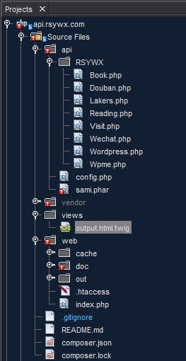

#结构

##Silex框架下WEB程序的一般结构

Silex既然与Symfony同根生，其基本的理念保持一致也就不奇怪了。但是，作为一个轻量级框架，它舍弃了很多“重”的东西，比如：不必有路由部件，不支持ORM（而只支持DBAL），控制器的配置也大为直接……等等等等。

我们要开发的这个API站点其完整结构如下：



一般而言，Silex的应用包括这么几个目录：

* `vendor`：这里是所有应用所依赖的库。一般情况下我们不用关心这里。它是由`compoer`自动维护的。
* `views`：这里存放模板。我们这个应用只是一个后台API接口程序，所以不会有很多模板。这里放了一个模板的目的，是为了在API被调用时能用比较有组织的方式输出内容给调用方。
* `web`：这里才是Silex应用的根目录。其中的`index.php`文件是应用入口文件（稍后描述）。

##RSYWX API应用的结构

上图中，我们还可以看到`api`目录。这是本应用所有API接口文件的保存之处。为了保持命名空间的独立，我将所有这些文件放置在`RSYWX`目录之下。

所有这些接口的PHP文件都至少要符合[PSR-4规范](http://www.php-fig.org/psr/psr-4/)（中文介绍见[此处](https://segmentfault.com/a/1190000000380008)）。

符合PSR-4规范的类和命名空间可以被应用自动加载（autoload）。当然，我们也要给应用这个指令使其加载。方法是修改`composer.json`文件，加入这一行：

```
{
    "require": {
        ... ...
    },
    "autoload": {
        "psr-4": {
            "RSYWX\\": "api/RSYWX"
        }
    }
}
```

这样一来，我们以后在应用中对这些类的命名，都可以被冠以`RSYWX`的前缀而直接调用，再也不用那些很笨拙的`include`，`require`等语句了。

在应用开发过程中，我最费心的地方是在如何定义路由。

从Web调用的角度来看，一个URI（比如'`/book/summary`')会调用后台应用中的某个动作。一个自然的映射关系（套用一般的）是它将调用`book`控制器里的`summary`动作；而一个带参数的URI（比如'`/book/bookbybookid/00666`'）则要调用`book`控制器里的`bookbyBookdid`动作，并且要传递参数（`00666`）给该动作。

问题在于，我们有不同的控制器，每个控制器都有不同的动作，也就要求不同的路径。即以本应用为例，我们有8个控制器（实际在[rsywx.net](https://rsywx.net)中用到），每个控制器少则2个动作，多则10余个动作。我们若为每个动作分配一个路由配置，一则不灵活，二来也太麻烦。所以，我们会用到更高级的做法。

##`index.php`的编写

###相关部件注册

```
require_once __DIR__ . '/../vendor/autoload.php';

$app = new Silex\Application();

$app['debug'] = true;
//在生产环境中，将debug设置为false

// Twig registration
$app->register(new Silex\Provider\TwigServiceProvider(), ['twig.path' => __DIR__ . '/../views']);

// Doctrine DBAL registration
$app->register(new Silex\Provider\DoctrineServiceProvider(), [
    'dbs.options' => [
        'rsywx' => [
            'driver' => 'pdo_mysql',
            'host' => 'localhost',
            'dbname' => 'xxxxx',
            'user' => 'xxxxx',
            'password' => 'xxxxx',
            'charset' => 'utf8',
        ],
        'blog' => [
            'driver' => 'pdo_mysql',
            'host' => 'localhost',
            'dbname' => 'wordpress',
            'user' => 'xxxxx',
            'password' => 'xxxxx',
            'charset' => 'utf8',
        ]
    ]
]);
```
这段代码我们不多做说明。需要注意的一点是我们用到了两个数据库，所以对应的DBAL的参数也设置了两份。

###一般调用的通用路由

应用中设置了三种一般调用的通用路由：不带参数，带一个参数，带二个参数。视实际情况，可以再设置带更多参数的通用路由，不过这种情况一般很少见。即便出现的话，我个人认为用特定路由可能反而会更好。

这三种通用路由的写法都很类似。一并展示如下：

```
$app->get('/{entity}/{func}', function ($entity, $func) use ($app) {
    $status = 404;
    $result = "Method not implemented";

    $namespace = 'RSYWX\\' . ucfirst($entity);

    if (method_exists($namespace, $func))
    {
        $result = call_user_func_array([$namespace, $func], [$app]);
        $status = 200;
    }
    $out = ['status' => $status, 'out' => $result];
    return json_encode($out);
});

$app->get('/{entity}/{func}/{param}', function($entity, $func, $param) use ($app) {
    $status = 404;
    $result = "Method not implemented";

    $namespace = 'RSYWX\\' . ucfirst($entity);
    if (method_exists($namespace, $func))
    {
        $result = call_user_func_array([$namespace, $func], [$param, $app]);
        $status = 200;
    }
    $out = ['status' => $status, 'out' => $result];
    return json_encode($out);
});

$app->get('/{entity}/{func}/{param1}/{param2}', function($entity, $func, $param1, $param2) use ($app) {
    $status = 404;
    $result = "Method not implemented";

    $namespace = 'RSYWX\\' . ucfirst($entity);
    if (method_exists($namespace, $func))
    {
        $result = call_user_func_array([$namespace, $func], [$param1, $param2, $app]);
        $status = 200;
    }
    $out = ['status' => $status, 'out' => $result];
    return json_encode($out);
});
```
简单说明一下：

* 首先定义返回状态和返回值。缺省是'`404`''和“``该方法未曾实现``”。这是为了防止客户端调用不存在的动作。调用端可以根据返回值进行一些判断。
* 然后构造命名空间。一般来说URI是全部用小写字母构成的，而类的命名又一般会首字母大写。所以我们用`ucfirst`函数将`/book/summary`中的`book`变成`Book`。这样才能找到对应的类。
* 接着判断该命名空间+实体类下的动作（方法）是否存在。如果存在则调用该函数，并传递参数。
* 最后将结果封装到一个数组然后转换成JSON格式返回。

特别需要注意的是`call_user_func_array`的调用。按照PHP官方文档的[说明](http://php.net/manual/zh/function.call-user-func-array.php)：

>mixed call_user_func_array ( callable $callback , array $param_arr ) — 调用回调函数，并把一个数组参数作为回调函数的参数。

当`$callback`是一个类中的方法是，需要将类（及命名空间）和方法以数组方式传递。所有的参数传递也必须以数组进行。

至此，本应用的结构已经剖析完毕。

以下进入非常简单明快的编程环节。
