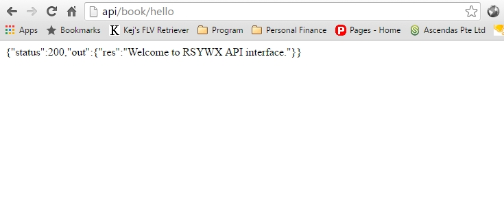
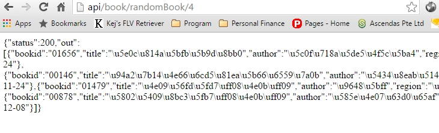

# Book类详细分析

基于本应用的[结构](https://taylorr.gitbooks.io/-silex-restful-api/content/03.%20structure.html)，后台API的编写其实是非常直观而简单的。

本节中我们以`Books`类为例简要说明几个方法的编写过程。

所有类的方法和参数说明可以参见[API说明站点](http://api.rsywx.com)。

（**顺便说一句，API文档是用[Sami](https://github.com/FriendsOfPHP/Sami)这个工具生成的。**）

## `hello`：打个招呼

这个方法很简单，主要用来调试并证明服务器正常，调用正常。

### 源代码

```
public static function hello()
{
    return (['res' => "Welcome to RSYWX API interface."]);
}
```
### 调用

在浏览器地址栏中，根据你服务器的配置，输入类似`http://api/book/hello`的URI。

### 返回

如下图所示。



## `randomBook`：随机找几本书

### 源代码

```
public static function randomBook($num, $app)
{
    $sql = "select bookid, title, author, region, purchdate from book_book order by rand() limit $num";
    $res = $app['db']->fetchAll($sql);
    return $res;
}
```
### 调用

在浏览器地址栏中，根据你服务器的配置，输入类似`http://api/bool/randomBook/4`的URI。

### 返回

如下图所示（部分）。



如果输出中的`\u9648`这样的字符串不能让我们直观地看到内容，可以将这些内容全部拷贝的一些在线JSON转换工具中，看看输出的内容。

其它类方法的流程和编写与上述类似，不再赘述。
